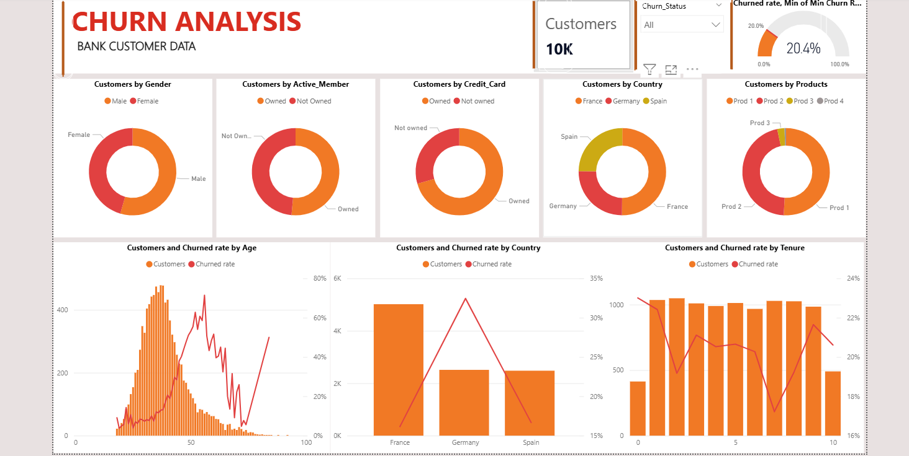

# Bank-Customer-Churn-Analysis-Project-
This project predicts bank customer churn using historical customer data (demographics, account details, and engagement features) and applies Python analysis plus a Power BI dashboard to identify key churn drivers and support data‑driven retention decisions. 

---

## Business Problem

Banks lose significant revenue when customers churn. This project answers the question: *Which customers are most likely to leave the bank, and why?*  
Understanding churn drivers helps banks take proactive retention actions, improve customer satisfaction, and increase long-term profitability.

---

## Dataset

- **Source:** Public Bank Customer Churn Dataset (Kaggle)
- **Size:** 10,000 rows, 12 columns
- **Time Period:** Not time-series based (customer snapshot data)
- **Key Tables / Features:**
  - Customer Demographics (Age, Gender, Country)
  - Account Information (Balance, Tenure, Number of Products)
  - Engagement Indicators (Active Member, Credit Card)
  - Target Variable: `Churn`

---

## Tools Used

- **Python:** Pandas, NumPy, Matplotlib, Seaborn  
- **SQL:** Data querying & aggregation  
- **Power BI:** Interactive dashboard & visualization  
- **Excel:** Quick data inspection and validation  

---

## Key Findings

1. **Overall churn rate is ~20%**, indicating 1 in 5 customers leaves the bank.
2. **Customers aged 40+ show a higher churn rate** compared to younger customers.
3. **Inactive members are significantly more likely to churn** than active customers.
4. Customers holding **only one product** have a higher churn probability.

---

## Dashboard Preview

---

## Recommendations

- Target **inactive customers** with personalized engagement campaigns.
- Offer **multi-product incentives** to customers holding only one product.
- Focus retention efforts on **high-balance, high-risk age groups**.
- Use churn prediction scores to prioritize proactive outreach.
